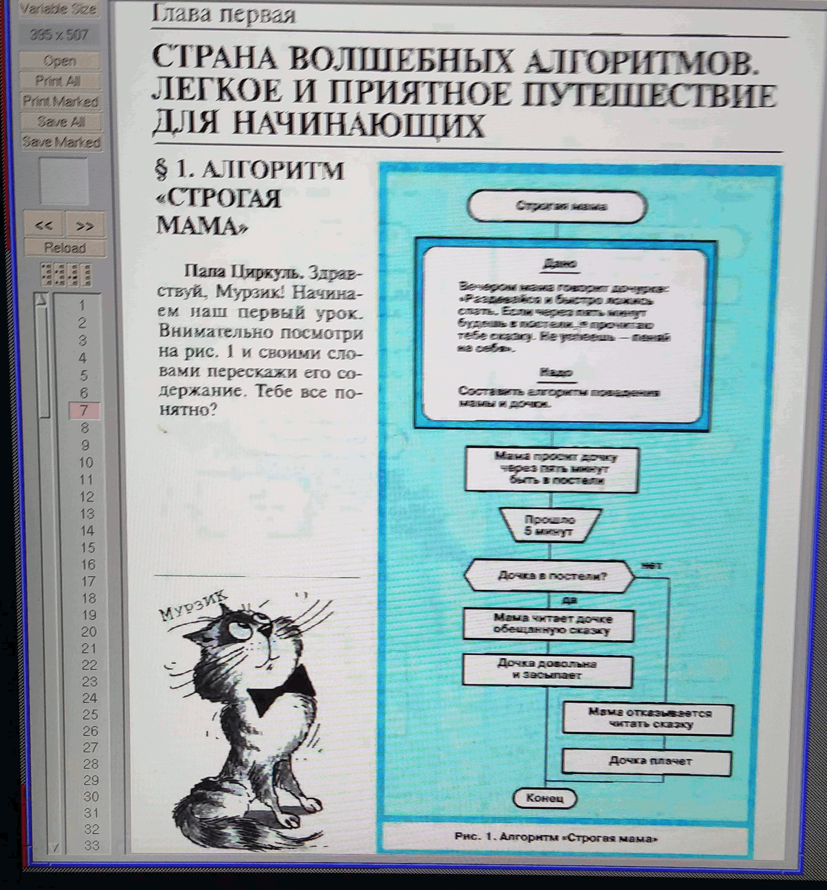

# Abstract

A fork of OpenBSD to address pervasive security, data integrity, and reliability problems due to a lack of adequate systems engineering.

# Insecurity of the OpenBSD 7.3/amd64 distribution

The automatic and mandatory-by-default reordering of OpenBSD kernels is NOT transactional and as a result, a local unpatched exploit exists which allows tampering or replacement of the kernel. Arbitrary build artifacts are cyclically relinked with no data integrity or provenance being maintained or verified for the objects being consumed with respect to the running kernel before and during the execution of the mandatory kernel_reorder process in the supplied /etc/rc and /usr/libexec scripts. The reordering occurs at the end of installation process and also automatically every reboot cycle thereafter unless manually bypassed by a knowledgable party.

The kernel_reorder routine verifies a SHA256 signature for the linked kernel from last boot but does not verify the integrity or provenance of any objects kept in the kernel "link kit" installed in /usr/share/relink, so arbitrary objects can be injected and automatically relinked at the next startup. I have verified that it is indeed the case that both valid kernels with a different uname and kernels which cause data destruction due to over-tuning of a subset of the components which were compiled manually and copied into /usr/share/relink and crash the system after being booted once relinked but which do not match the build of the running kernel at the time they were copied into /usr/share/relink as working proof-of-concept exploits.

 
Fig. 2: OpenBSD 7.3

# Tampering

Install media are also open to tampering and exploitation as signed checksum data are not carried with the install sets inside the installation image and an improperly-encapsulated poorly-documented tarball of unverifiable (in the sense of SLSA) kernel objects is embedded in the base distribution and then relinked with a new random ordering of the objects cyclically between boot cycles.

Sites with a strong security posture are advised that this is a critical vulnerability and likely deliberate back door into the system. Additionally, OpenBSD leaks the state of the pseudorandom number generator to predictable locations on disk and in system memory at a fixed point during every start up and shutdown procedure - "random_seed()" in /etc/rc. There isn't even an attempt to collect entropy before running it at startup or collect entropy during the install from the network or the user. The lack of build process hardening has been on-going for over three years. Theo de Raadt is disinterested in improving or reviewing the design or providing any further clarification, as he has stated on the mailing list when shortfalls in the relinking process were reported over the past ~3 years. I hope that this can come to the attention of a third-party technical expert with standing in the computer security industry.

# Workaround:

As the link kit is embedded in the base distribution and automatically relinked without an option to disable it in the provided installation script it requires manual removal at present.

Cf.

https://marc.info/?l=openbsd-bugs&m=159074964523007&w=2 (noted lack of idempotency)
https://marc.info/?l=openbsd-bugs&m=168688579123005&w=2 (noted lack of integrity or provenance verification and the consumption of invalid objects)

https://slsa.dev/spec/v1.0/levels#build-l2-hosted-build-platform:

"Track/Level Requirements 	            Focus
 Build L3 	  Hardened build platform 	 Tampering during the build"

# Addendum

The official response from Theo de Raadt it's irrelevant. "Security and correctness" is apparently the focus according to the INSTALL blurb. Into the trash it goes.

Additional architectural security flaws found since the intial writeup through additional investigation and recompilation efforts with a clean GNU compiler set:

# ports.tar.gz

mozilla-firefox port shims it's own version of cc and clang rather than respecting system-provided compilers

# src.tar.gz

Compiler reinstallation and overwriting in addition to self-hosting:

Ambiguously renaming gcc to egcc by default to make GNU autoconf configuration scripts fail and calling all compilers installed by the system cc instead of clearly identifying the compiler as clang and using a symlink or chooser cf. e.g. Debian allows the following shim to be put in place that will not be noticed unless by an astute administrator.

- Userland build process reinstalls the "cc" embedded in the distribution over the system cc when installed
- firefox port build installs a nested compilation of rust, which shims its own clang compiler ignoring the environment; with a huge number of randomly-contributed dependencies.

Following the naming convention of cc for distribution compiler, gcc for gcc and clang for clang ameliorates this problem. There is a reason that Intel ships a compiler - it's so you know that you aren't in a garbage-in-garbage out situation with a chain of shoddy software. If Intel wants to put backdoors in they put them in another module or the microcode or both or implement functions completely in hardware. That is why we also have AMD. There is no reason to imagine that the Minix running inside the management engine is not completely isolated. They have the complete source for V6 Unix and for Minix and a completely sterile build environment plus the top experts. 

OpenBSD clang 13.0 is over 80 mb of ELF code, gcc 8.x is 1.1 MB... 

Such nested installation and build processes are now pervasive, not just in the operating system bootstrap. This is completely against the ethos of a standard distribution's base system.

Analyst comments:

UNVEIL and rootkits:

UNVEIL(2) can be used to hide undocumented background processes, essentially turns OpenBSD into Android. 

savecore (1) is broken even in "permanently insecure" mode.

A tool such as DTrace and modern memory forensics are required for higher assurance of system behaviour in any tractable sense.

Additionally firefox is basically unusable - the model of monolithic systems and "apps", and only more such "hardening will happen in the future, making the provided packages even harder to debug or verify functionality.

Fig. 1: Theory

 
Fig 3. CBSD Implementation

